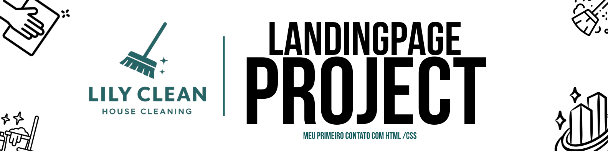

  

  <b>“Your Home, Our Care.”</b> 
  Site institucional fictício criado com <b>HTML5</b> e <b>CSS3</b> para prática de estrutura, design e responsividade.

---

  
  
  
  
  

---

<h2 align="center">🧹 Sobre o Projeto</h2>

  <i>LilyClean</i> é um site fictício desenvolvido para uma empresa de serviços de limpeza residencial. 
  Criado durante com o objetivo de praticar estrutura semântica em HTML, estilização moderna em CSS e publicação no GitHub Pages.

---

<h2 align="center">🚀 Funcionalidades</h2>

  ✅ Página principal com navegação por seções 
  ✅ Sessões: <b>About Us</b>, <b>Services</b> e <b>Contact</b> 
  ✅ Formulário de contato estilizado 
  ✅ Efeitos <i>hover</i> e transições suaves 
  ✅ Layout totalmente responsivo

---

<h2 align="center">🖼️ Preview</h2>

  

  <i>(Captura de tela do site publicado)</i> 
  <a href="https://seuusuario.github.io/lilyclean-website" target="_blank">
    🔗 Clique aqui para visualizar o site ao vivo no GitHub Pages
  </a>

---

<h2 align="center">🛠️ Tecnologias Utilizadas</h2>

<table align="center">
  <tr>
    <th></th>
    <th></th>
  </tr>
</table>

---

<h2 align="center">🧠 Aprendizados</h2>

  Durante o desenvolvimento aprendi a:

  • Estruturar páginas com tags semânticas  
  • Usar <b>Flexbox</b> e <b>transições CSS</b>  
  • Criar formulários responsivos e com foco visual  
  • Organizar pastas e arquivos de forma profissional  
  • Publicar um site estático completo no <b>GitHub Pages</b>

---

<h2 align="center">📫 Contato</h2>

  👤 <b>Diogo Teodoro Lamas</b> 
  🎓 Estudante de <b>Sistemas de Informação</b> — IFES Colatina 
  📧 <a href="mailto:diogo.teodoro015@gmail.com">diogo.teodoro015@gmail.com</a> 
  🌐 <a href="https://github.com/TheTekig">github.com/TheTekig</a>

---

  <b>© 2025 LilyClean.</b> Todos os direitos reservados. 🌿

